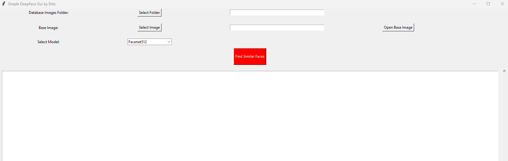

# deepface-gui
**Simple GUI for deepface ONLY "DeepFace.find"** 




[Face recognition](https://sefiks.com/2020/05/25/large-scale-face-recognition-for-deep-learning/) requires applying face verification many times. Herein, deepface has an out-of-the-box find function to handle this action. It's going to look for the identity of input image in the database path and it will return list of pandas data frame as output. Meanwhile, facial embeddings of the facial database are stored in a pickle file to be searched faster in next time. Result is going to be the size of faces appearing in the source image. Besides, target images in the database can have many faces as well.


```python
dfs = DeepFace.find(img2_path, db_path=db_path, model_name=selected_model, enforce_detection=False)
```
Added Drop Down -  Chose between certain models
FaceNet, VGG-Face, ArcFace and Dlib are [overperforming](https://youtu.be/i_MOwvhbLdI) ones based on experiments. You can find out the scores of those models below on both [Labeled Faces in the Wild](https://sefiks.com/2020/08/27/labeled-faces-in-the-wild-for-face-recognition/) and YouTube Faces in the Wild data sets declared by its creators.

| Model | LFW Score | YTF Score |
| ---   | --- | --- |
| Facenet512 | 99.65% | - |
| SFace | 99.60% | - |
| ArcFace | 99.41% | - |
| Dlib | 99.38 % | - |
| Facenet | 99.20% | - |
| VGG-Face | 98.78% | 97.40% |
| *Human-beings* | *97.53%* | - |
| OpenFace | 93.80% | - |
| DeepID | - | 97.05% |
